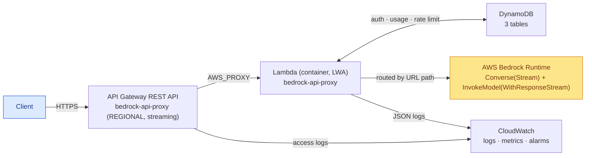
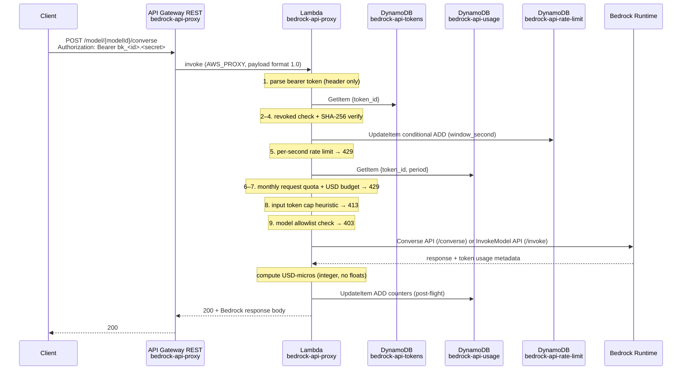
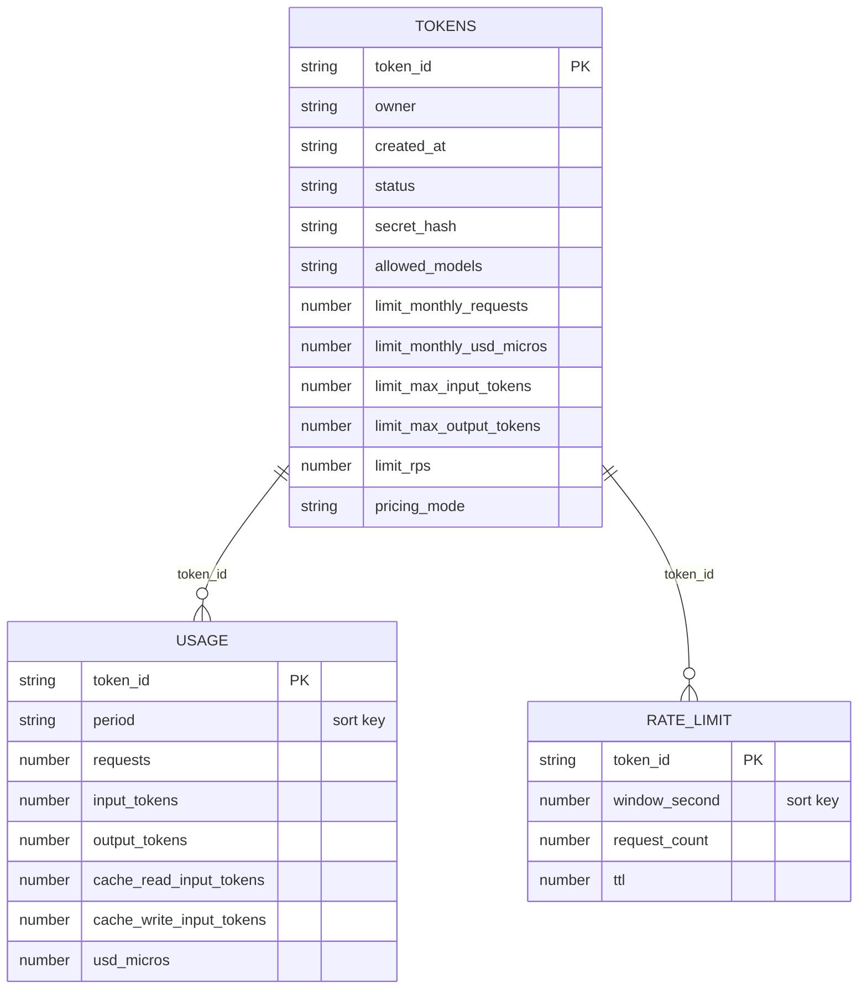
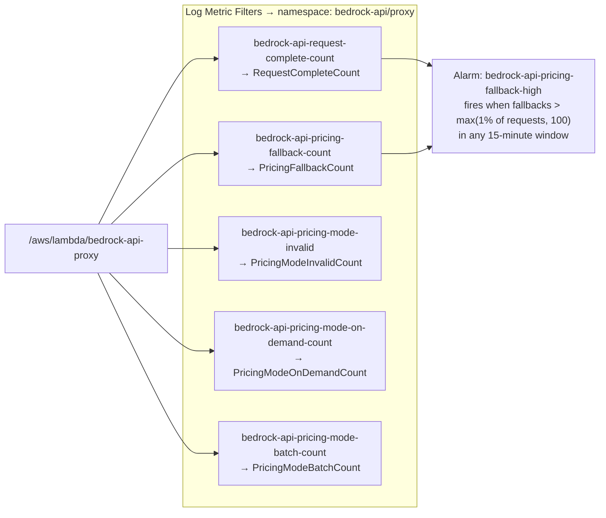

# bedrock-api Architecture

## Overview

A serverless AWS proxy that authenticates bearer tokens, enforces per-token limits, and forwards requests to AWS Bedrock. All resource names are prefixed `bedrock-api-`.

---

## System Overview



---

## Infrastructure Layout

```mermaid
graph TB
    Client["Client<br/>(Bearer bk_&lt;id&gt;.&lt;secret&gt;)"]

    subgraph APIGW["API Gateway REST API — bedrock-api-proxy (REGIONAL)"]
        Stage["v1 stage<br/>throttle: 20 rps / 40 burst<br/>response streaming (STREAM)"]
        RouteProxy["ANY /{proxy+}"]
        RouteRoot["ANY /"]
        RouteOther["FastAPI routes by path → 404 if unknown"]
    end

    subgraph Lambda["Lambda — bedrock-api-proxy (container image, LWA)"]
        Handler["FastAPI app via uvicorn<br/>alias 'live' · provisioned concurrency 1<br/>512 MB · 900s · reserved concurrency 50"]
    end

    subgraph DynamoDB["DynamoDB (PAY_PER_REQUEST)"]
        Tokens["bedrock-api-tokens<br/>PK: token_id<br/>GSI: owner-index"]
        Usage["bedrock-api-usage<br/>PK: token_id · SK: period"]
        RateLimit["bedrock-api-rate-limit<br/>PK: token_id · SK: window_second<br/>TTL: ttl"]
    end

    Bedrock["AWS Bedrock Runtime<br/>/converse(-stream) → Converse(Stream)<br/>/invoke(-with-response-stream) → InvokeModel(WithResponseStream)"]

    PricingS3["S3: bedrock-api-pricing-&lt;account&gt;<br/>pricing/current.json<br/>(live pricing catalog)"]

    subgraph CW["CloudWatch"]
        LogLambda["/aws/lambda/bedrock-api-proxy"]
        LogAPI["/aws/apigateway/bedrock-api-proxy"]
        Alarm["Alarm: bedrock-api-pricing-fallback-high"]
    end

    Client -->|HTTPS| Stage
    Stage --> RouteProxy
    Stage --> RouteRoot
    Stage --> RouteOther
    RouteProxy -->|AWS_PROXY · STREAM| Handler
    RouteRoot -->|AWS_PROXY · STREAM| Handler
    Handler -->|GetItem| Tokens
    Handler -->|GetItem + UpdateItem| Usage
    Handler -->|UpdateItem| RateLimit
    Handler -->|routed by URL path| Bedrock
    Handler -->|read live catalog (TTL); admin refresh writes| PricingS3
    Handler -->|JSON logs| LogLambda
    Stage -->|access logs| LogAPI
    LogLambda -->|metric filters| Alarm

    classDef bedrockStyle fill:#fde68a,stroke:#d97706,color:#78350f
    classDef clientStyle fill:#dbeafe,stroke:#1d4ed8,color:#1e3a8a
    class Bedrock bedrockStyle
    class Client clientStyle
```

---

## Request Pipeline



---

## DynamoDB Table Schemas



---

## CloudWatch Observability


